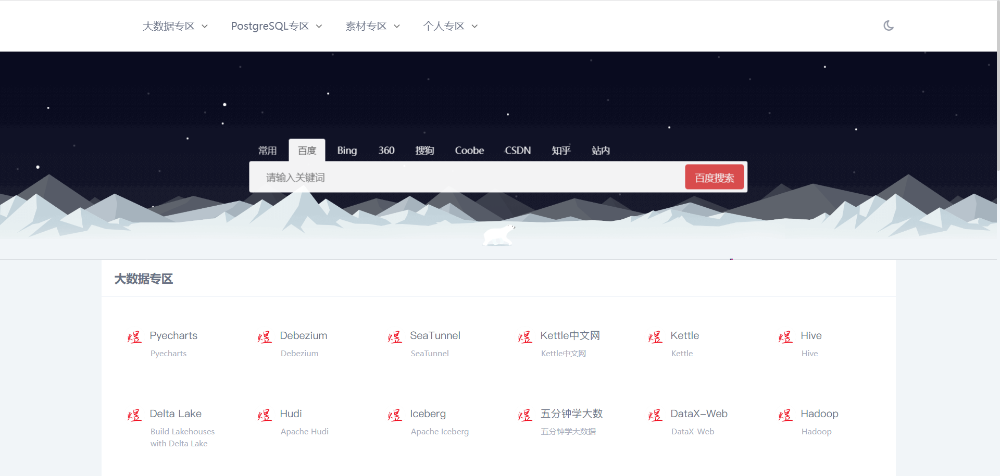

# pynavs

简约导航页面



### 安装python库

```bash
pip install flask tinydb
```

### 初始化数据并启动

```bash
python install.py
python app.py
```

### 打开浏览器访问

```
http://127.0.0.1:12345
```

### 配置文件 `config.py`

```python
DBFILE  # tinydb的路径

PORT = 12345  # web 端口
```

### 管理链接

可打开 `DBFILE`，修改json内容